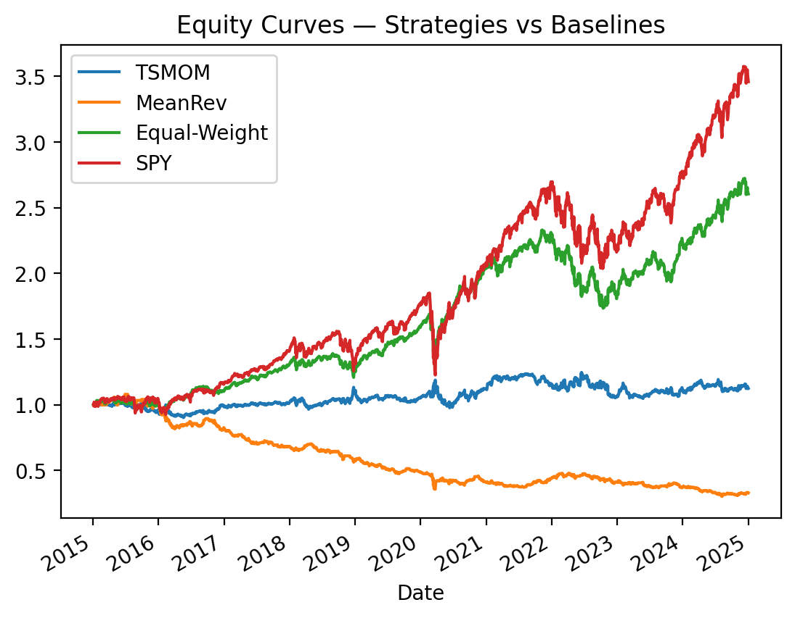
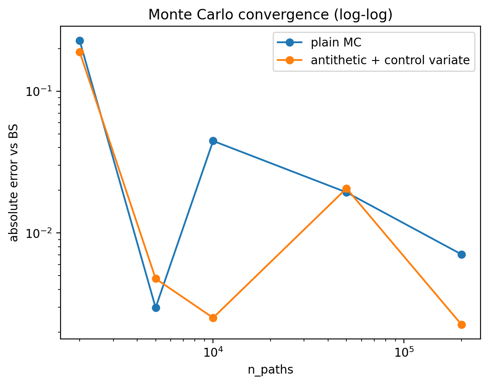
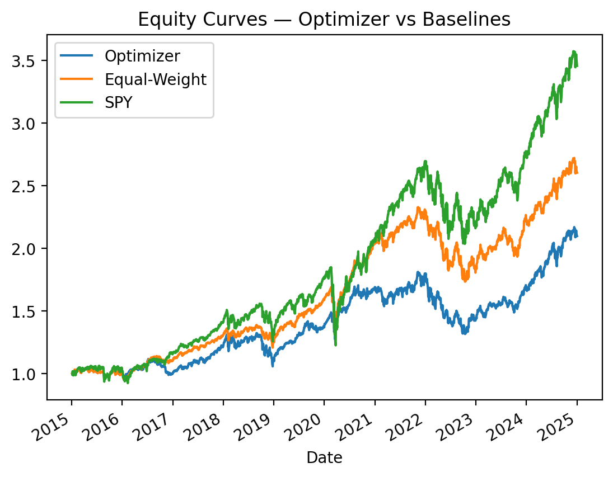

# Quant Mini Lab — Backtesting, Options, and Portfolio Optimization (Python)

A small, test-driven quantitative finance lab with three components:
- **Backtesting** (signals → weights → PnL, no lookahead, costs via turnover, robustness checks)
- **Options** (Black–Scholes prices/Greeks/IV + Monte Carlo with variance reduction)
- **Portfolio optimization** (constrained mean–variance in CVXPY, rolling out-of-sample)

## Highlights (1-minute scan)
- End-to-end workflow: **data → model → validation → diagnostics**
- Correctness checks: **put–call parity**, **IV inversion**, plus a **pytest** suite
- Benchmarks & robustness: baselines + sensitivity to parameters / costs
- Constraints validated empirically: long-only, caps, turnover bounds

## Figures

### Backtest — strategies vs baselines


### Options — Monte Carlo convergence (log-log)


### Optimizer — equity vs baselines


---

## How to run

```bash
python3 -m venv .venv
source .venv/bin/activate
python -m pip install -U pip
pip install -r requirements.txt
pip install -e .
python -m pytest -q
```

## Run notebooks
- `notebooks/01_backtest.ipynb`
- `notebooks/02_options_pricing.ipynb`
- `notebooks/03_portfolio_optimization.ipynb`

## Repo map
- `src/qmlab/` — library code (data, metrics, backtest, BS/IV/MC, optimizer)
- `tests/` — pytest unit tests
- `notebooks/` — analysis notebooks
- `assets/` — figures used in the README

## Notes / limitations
- Costs are simplified (bps × turnover), no explicit slippage/impact model.
- Small ETF universe (chosen for interpretability).
- Mean–variance optimization uses basic sample estimates (sensitive to estimation error).

## Suggested next steps (optional)
- Vol targeting / continuous trend strength (backtests)
- Covariance shrinkage (e.g., Ledoit–Wolf) + risk parity / min-var baselines
- MC convergence averaged across multiple seeds